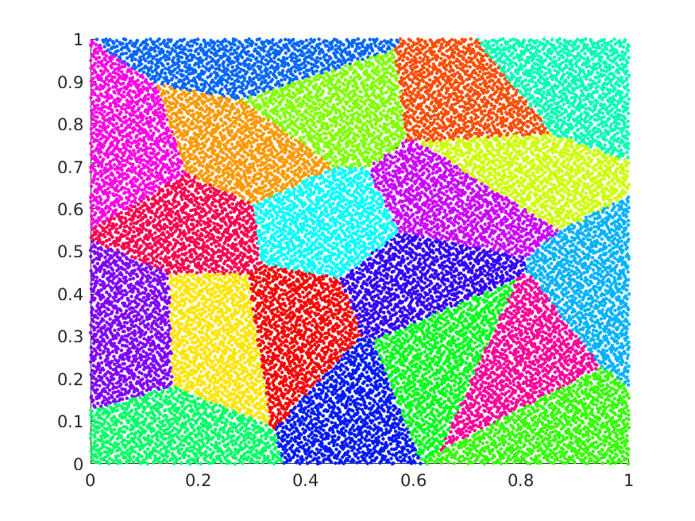

# cuOMT: A CUDA/C++ Implementation of the Adaptive Monte Carlo Optimal Transport Algorithm
 This work is licensed under a <a rel="license" href="http://creativecommons.org/licenses/by-nc/4.0/">Creative Commons Attribution-NonCommercial 4.0 International License</a>.

This repository contains **cuOMT**, a CUDA/C++ solver utilizing the Adaptive Monte Carlo Optimal Transport (MC-OT) algorithm. See [here](https://github.com/k2cu8/pyOMT)
 for a PyTorch implementation.

## Big ideas
The adaptive MC-OT algorithm aims to solve *high-dimensional* optimal transport problem, through solving a *convex* optimization problem.
Basically, given a source distribution and a target distribution, the optimal transport problem is to find the *optimal* transport plan to
move the mass on the source distribution to the target distribution. For example, imagine the source distribution consists of how much bread made by each bakeries, 
and the target distribution consists of the amount of bread needed by each cafe shops. The bakeries and cafes are located at different places and there are transporting costs moving bread from one location to another. Then the optimal transport problem is to find a transport plan
moving the bread from the bakeries to the cafe shops minimizing the total transport cost. 

Optimal transport problems arise whenever one needs to find a "good" mapping (i.e. OT mapping) that transform a distribution to another. For example, 
in deep learning field, generative models are designed to generate infinately many samples similar to those from a given dataset. 
If we take samples of the dataset as an i.i.d sampling of a latent distribution (potentially of high dimension), then with a OT mapping
bewteen a prior known distribution (e.g. uniform) and this latent distribution, one can generate infinitely many new data by first taking samples in the prior distribution and then map them to the target distribution by the OT map.

<!-- A large class of deep neural network models have been designed to solve OT problems (e.g. GANs). In contrast to the approach used here, training such DNNs involves solving *non-convex* optimization problems and potentially hard to converge if the transport map the DNNs try to regress to is discontinuous. The OT solver here provides an efficable alternative to these methods.  -->

The solver in this repository solves a particular class of OT problems, namely the semi-discrete OT problem, where the source distribution is continuous and the target distribution is discrete (i.e. a finite sum of Dirac distributions). In the demo below, the source distribution is the 2-dimensional uniform distribution on the unit square [0,1]^2 and the target distribution consists of 20 Dirac distributions, with each randomly positioned in the unit square and has mass 1/20. Our goal is to find a mapping, that maps each point in the unit square to one of the 20 target points, such that for each target point, the total mass being mapped to it (viewed as colored regions in the figures below) equals to 1/20. 

<!--    -->
 

Figures above illustrate the optimization process (left) and the final result (right). In each iteration, the transported distribution under the *current* calculated transport mapping is displayed, with different colored regions representing masses on different target points. After convergence, approximately 1/20 of the total area of [0,1]^2 is assigned to each target point, and the total distance between each points in [0,1]^2 and their images under the transport mapping is minimal. 

To accelerate the convergence, the ADAM gradient descent method is also implemented here. Figures below illustrate its optimization process (left) and the final result (right):

<!--    -->
 

We can see that the converging path here is different from the previous example that uses vanilla gradient descent method. However, the final result remains the same, as convex optimization is happening here.

## Implementation
Under the variational principle of solving semi-discrete OT problems, the solver implemented here minimizes the convex energy by adopting the Monte Carlo approach. Traditionally, this energy is precisely calculated with geometric methods and data structures (i.e. triangular meshes in 2-D and tetrahedral meshes in 3D), whose high-dimsional counterparts are either too much memory consuming or numerically unstable (e.g. calculating high-dimensional convex hulls). The approach here is to approximate the energy with Monte Carlo integration, and then optimize it using gradient descent methods. Thanks to the convexity of the energy, the algorithm is robust and the final results converge to a unique solution regardless of converging paths. 

Codes are written in CUDA/C++. In particular, the CUDA libraries cuRAND, cuBLAS and Thrust are used. Thanks NVIDIA for the comprehensive user manuals for the toolkits. 

## Requirements
Currently only Linux is supported. The following tools are needed:
* gcc >= 7.4.0
* CUDA toolkit >= 10.0 

## Building:
> make

## Running:
> ./cuOMT \**mode*\* \[-parameters params ...\] \[\-\-flags ...\]

* \**mode*\*: Running mode including 
    * "simple": default running mode.
    * "batch": batch running mode, where multiple batches MC samples are generated to more precisely evaluate the energy.
    * "multi": \[experimental\] in addition to batch mode, the locations of target samples are passsed to device in multiple batches. Used when dataset is large.
    * "clean": clean cached files.

* "-parameters params": parameters like input files are specified here:
    * "\-P path": path to the csv file containing the locations of target points.
    * "\-A path": path to the csv file containing mass distributions on each target points.
    * "\-h": path to the csv file containing model weight "h", the sole variants to be optimized (see references for detail). Used to resume training.
    * "\-adam_m": path to the csv file containing optimizer weight "adam_m". Used to resume training.
    * "\-adam_v": path to the csv file containing optimizer weight "adam_v". Used to resume training.
    * "\-num_cell": number of target points. Integer.
    * "\-dim": ambient dimension of target points. Integer.
    * "\-num_MC_sample": number of Monte-Carlo samples to use in each iteration. Integer.
    * "\-num_batch": number of multiples of MC_samples. Total number of MC sample per iteration = num_batch * num_MC_sample. Used in batch and multi mode only. Integer.
    * "\-num_cell_batch_size": number of mini-batch of target samples to be fed into device. Must be a factor of num_cell. Used in multi mode only. Integer.
    * "\-max_iter": number of maximum steps of iteration. Integer.
    * "\-lr": learning rate (i.e. step length) of the gradient descent procedure. Float.
    * "\-eps:": convergence criterion. Float.

* "\-\-flags": optional flags including
    * "\-\-no_output": suppresses file outputs during the optimization. 
    * "\-\-quiet_mode": suppresses most of the screen printing during the optimization.

## Demo code
To reproduce the figures shown above:
> ./cuOMT batch -P data/test_P.csv -lr 1e-3

and run the following script in MATLAB:
> show_result

Please feel free to open an issue or email me at yangg20111@gmail.com for any questions and suggestions. Happy coding!

## References
    @article{gu2016variational,
    title={Variational principles for Minkowski type problems, discrete optimal transport, and discrete Monge-Ampere equations},
    author={Gu, Xianfeng and Luo, Feng and Sun, Jian and Yau, Shing Tung},
    journal={Asian Journal of Mathematics},
    volume={20},
    number={2},
    pages={383--398},
    year={2016},
    publisher={International Press of Boston, Inc.}
    } 

    @inproceedings{
    An2020AE-OT:,
    title={AE-OT: A NEW GENERATIVE MODEL BASED ON EXTENDED SEMI-DISCRETE OPTIMAL TRANSPORT},
    author={Dongsheng An and Yang Guo and Na Lei and Zhongxuan Luo and Shing-Tung Yau and Xianfeng Gu},
    booktitle={International Conference on Learning Representations},
    year={2020},
    url={[https://openreview.net/pdf?id=HkldyTNYwH]}
    }

